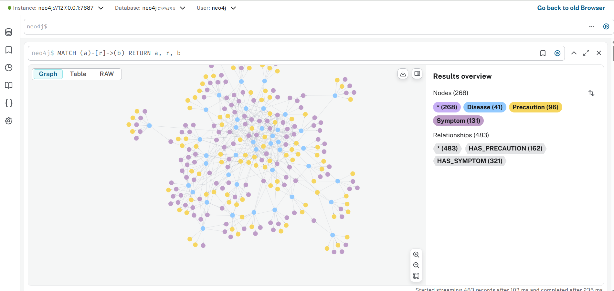
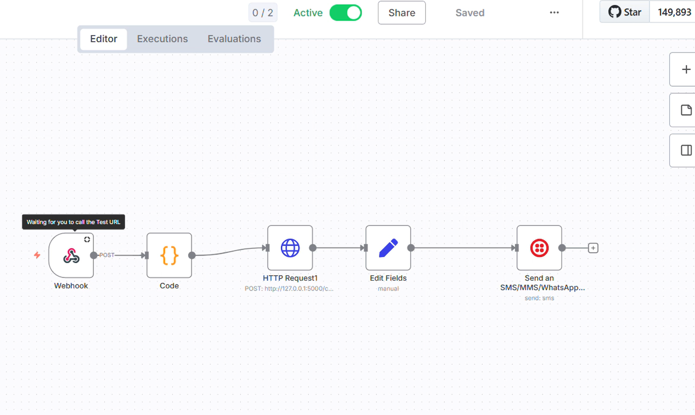

# WhatsApp MedAssistant

**Système d’Analyse Médicale et de Réponse Automatisée via WhatsApp**

Un assistant médical automatisé capable de comprendre les messages des patients, détecter les symptômes ou demandes de précautions, et générer des réponses contextualisées via un graphe médical et le modèle LLaMA.

---

## 🚀 Fonctionnalités principales

* Conception d’un graphe de connaissances médicales sous **Neo4j** (maladies, symptômes, précautions)
* **Analyse NLP** des messages WhatsApp et détection de l’intention médicale
* Génération de réponses **contextualisées et naturelles** avec **LLaMA**
* Gestion du contexte conversationnel pour suivi multi-interactions
* Automatisation complète via **n8n** et **Twilio WhatsApp Sandbox**

---

## 🛠️ Outils et Technologies

* **Python** : Backend principal
* **Flask** : API pour réception des messages et génération des réponses
* **Neo4j** : Graphe médical (maladies, symptômes, précautions)
* **n8n** : Orchestration et workflow automatique
* **Twilio WhatsApp Sandbox** : Communication avec les patients
* **Spacy & NLP** : Extraction et normalisation des symptômes
* **Ollama / LLaMA 7B** : Reformulation et génération de réponses naturelles

---

### 🔹 Description des dossiers et fichiers

* **chatbot_module.py** : Contient la logique principale du chatbot, appels aux fonctions de traitement.  
* **conversation_memory.py** : Stocke l’historique des conversations pour chaque utilisateur.  
* **handle_symptoms.py** : Extraction et normalisation des symptômes, recherche des maladies associées.  
* **handle_precautions.py** : Recherche des précautions liées aux maladies.  
* **llm_response.py** : Interaction avec le modèle LLaMA pour générer les réponses naturelles.  
* **server.py** : API Flask pour recevoir les messages et renvoyer la réponse du chatbot.  
* **README.md** : Documentation complète du projet.

### 🔹 Images et diagrammes
```markdown



## ⚡ Installation

1. Cloner le dépôt :
```bash
git clone https://github.com/fakhfakheya/WhatsApp-MedAssistant.git
cd WhatsApp-MedAssistant
## 🔹 Workflow n8n & Intégration Twilio

Le projet utilise **n8n** pour orchestrer l’automatisation complète de la réception, du traitement et de l’envoi de messages WhatsApp via **Twilio**.

### 1️⃣ Composants n8n utilisés

| Composant                     | Rôle |
|--------------------------------|------|
| Webhook                        | Point d’entrée pour recevoir les messages WhatsApp de Twilio |
| HTTP Request                   | Appel à l’API Flask (/chat) pour envoyer le texte utilisateur et recevoir la réponse générée par le chatbot |
| Set / Edit Fields              | Préparer et formater les données reçues ou à envoyer |
| Twilio – Send SMS / MMS / WhatsApp | Envoyer la réponse automatiquement au patient via WhatsApp |

---

### 2️⃣ Exemple de flow n8n

**Webhook**

```text
Type : POST
URL exposée : https://<votre_n8n_instance>/webhook/whatsapp
Payload attendu :
{
  "From": "<numéro>",
  "Body": "<message_utilisateur>"
}
HTTP Request

text
Copier le code
Méthode : POST
URL : http://localhost:5000/chat
Body :
{
  "user_text": {{$json["Body"]}},
  "from": {{$json["From"]}}
}
Set / Edit Fields

json
Copier le code
{
  "To": "{{$json['From']}}",
  "Body": "{{$json['reply']}}"
}
Twilio – Send WhatsApp

text
Copier le code
From : numéro Twilio Sandbox (ex. whatsapp:+14155238886)
To : numéro du patient
Body : réponse du chatbot


